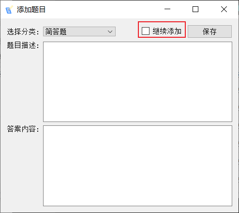
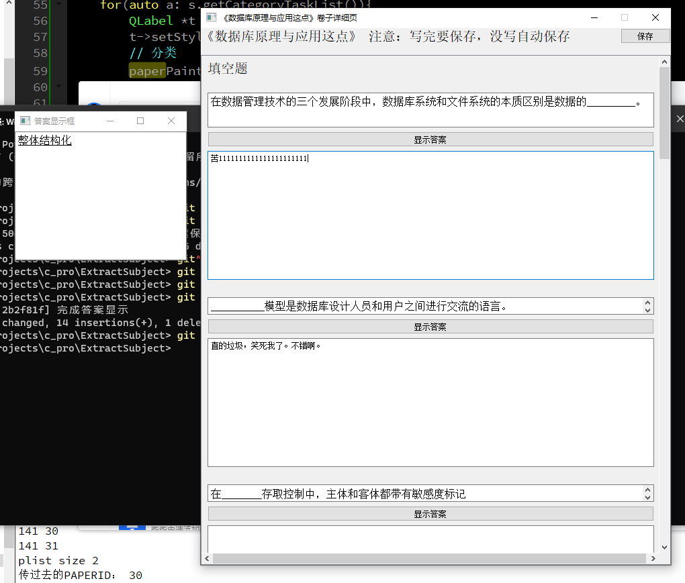

# Extract-Subject 抽题系统

 
         
          <h3>ExtractSubject</h3>
 

## 介绍

用来做抽题复习用的。

### 版本更新日志

#### 0.2

* 做题界面添加快捷键
    * Ctrl+S 保存答案
    * Ctrl+T 显示当前题目答案
* 添加和编辑题目界面
    * Ctrl+S 保存题目
    * 继续添加功能 : 添加一个题目后，可以选择指定分类，然后继续添加
 

#### 0.1 
   
* 完成基本功能，达到能用的程序

tag: 0.2 版本添加的继续"添加功能"

## 软件架构
就是简单的C++，然后使用的是Qt GUI。软件是开源的。

## 安装教程
后面会发布编译好的，但只支持windows

## 使用说明
打开软件就会用 

## 参与贡献
1. 皮豪（我自己）
